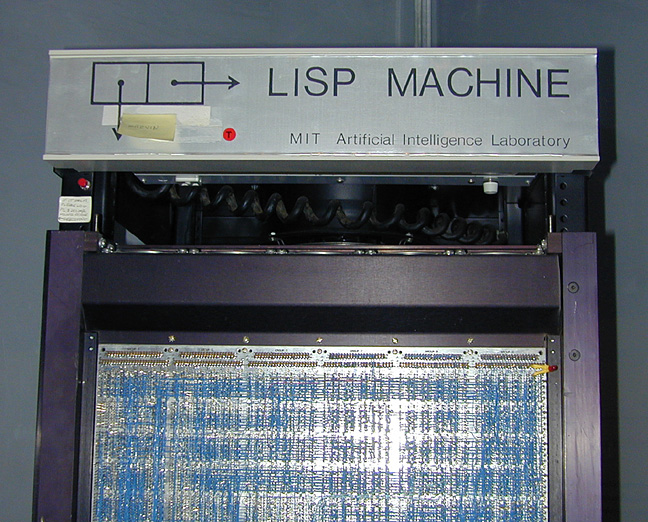

# 들어가며

🚧 사이트 공사중입니다.

LISP(`LIS`t `P`rocessing)

- **[간단하게 살펴보기(Learn X in Y minutes)](https://learnxinyminutes.com/ko/common-lisp/)**


- [CADR LISP Machine](https://metebalci.com/blog/cadr-lisp-machine-and-cadr-processor/)
  


## REPL

REPL: 읽고(`R`ead) 평가하고(`E`val) 출력(`P`rint)을 반복(`L`oop)

``` lisp
* (load "hello.lisp")
```

## Ref

- [wiki: Common Lisp](https://en.wikipedia.org/wiki/Common_Lisp)
